# 🖥️ MIRA Enterprise Desktop & Sovereign Governance Workbench
### High-Performance Native Desktop Application (Electron + Vite + React) for CPSE Material Harmonization & National Governance

> **"One Nation – One Material Code" | AI-Powered Material Standardization, De-duplication, Inter-Enterprise Harmonization & Inter-Plant Surplus Redistribution**

[](file:///c:/Users/PIYUSH/Desktop/BMUI/apps/web-desktop)
[-f59e0b?style=for-the-badge&logo=expo&logoColor=white)](file:///c:/Users/PIYUSH/Desktop/BMUI/apps/mobile)
[](#-enterprise-audit-trail--sovereign-compliance)
[](file:///c:/Users/PIYUSH/Desktop/BMUI/dataset)
[](#-sap-s4hana-purchase-requisition-gateway)

---

## 📑 Table of Contents

1. [Executive Summary & Purpose](#-executive-summary--purpose)
2. [The Core SHR Framework: Standardize, Harmonize, Rationalize](#-the-core-shr-framework-standardize-harmonize-rationalize)
   - [1. Standardize (Cleansing, Attribute Extraction, ISO-8000 Taxonomy)](#1-standardize-process)
   - [2. Harmonize (Cross-CPSE De-duplication, Zero-Disruption ERP Bridge, Maker-Checker Queue)](#2-harmonize-process)
   - [3. Rationalize (Surplus Redistribution, Price Variance Disparity, PR Gating)](#3-rationalize-process)
3. [Visual Software Walkthrough & UI Showcase](#-visual-software-walkthrough--ui-showcase)
   - [Part I: CPSE Enterprise Admin UI Suite](#part-i-cpse-enterprise-admin-ui-suite)
     - [1. CPSE Executive Dashboard](#1-cpse-executive-dashboard)
     - [2. Material Catalog Studio & Intra-Enterprise Duplicate Detector](#2-material-catalog-studio--intra-enterprise-duplicate-detector)
     - [3. Multi-Tier Plant Hierarchy & Nodal Officer Delegation](#3-multi-tier-plant-hierarchy--nodal-officer-delegation)
     - [4. Inter-Plant & Inter-CPSE Collaboration Canvas](#4-inter-plant--inter-cpse-collaboration-canvas)
     - [5. SAP S/4HANA Purchase Requisition (PR) Gateway](#5-sap-s4hana-purchase-requisition-pr-gateway)
     - [6. Zero-Trust Access Governance & Dynamic RBAC](#6-zero-trust-access-governance--dynamic-rbac)
     - [7. Officer Profile & Sovereign Identity Enclave](#7-officer-profile--sovereign-identity-enclave)
     - [8. Enterprise Audit Trail & Sovereign Compliance](#8-enterprise-audit-trail--sovereign-compliance)
   - [Part II: Sovereign National Governance UI Suite](#part-ii-sovereign-national-governance-ui-suite)
     - [9. MIRA Sovereign Unified Material Master](#9-mira-sovereign-unified-material-master)
     - [10. Maker-Checker Expert Review Queue](#10-maker-checker-expert-review-queue)
     - [11. Legacy Material Codes & Cross-CPSE Harmonization Mapping](#11-legacy-material-codes--cross-cpse-harmonization-mapping)
   - [Part III: Mobile Companion for CNMC Expert & Field Reviewers](#part-iii-mobile-companion-for-cnmc-expert--field-reviewers)
     - [12. MIRA Sovereign Mobile Review Terminal (iOS/Android Expo)](#12-mira-sovereign-mobile-review-terminal-expo-react-native)
4. [Desktop Application Architecture & Engineering](#-desktop-application-architecture--engineering)
5. [Role-Based Access Control (RBAC) & Authority Matrix](#-role-based-access-control-rbac--authority-matrix)
6. [Quick Start & Developer Setup](#-quick-start--developer-setup)
7. [Building & Packaging Native Desktop Installers](#-building--packaging-native-desktop-installers)
8. [Cross-Platform Linkage: Desktop & CNMC Expert Mobile App](#-cross-platform-linkage-desktop--cnmc-expert-mobile-app)
9. [Pre-Configured Demo Credentials](#-pre-configured-demo-credentials)

---

## 📌 Executive Summary & Purpose

The **MIRA Enterprise Desktop & Governance Application** (`apps/web-desktop`) is a sovereign, mission-critical desktop client developed for India's **Central Public Sector Enterprises (CPSEs)** (including **BHEL, ONGC, IOCL, SAIL, NTPC, Coal India, GAIL**) and Central Regulatory Authorities (**DPE, CVC, GeM**).

Built on top of **Electron 28**, **Vite 5**, **React 18**, and **TypeScript**, the desktop client provides an air-gapped, zero-latency operations workbench for:
- Chief Procurement Officers (CPOs) and Enterprise Administrators managing multi-plant operations.
- Plant Material Store Officers reconciling SAP S/4HANA & ECC purchase requisitions.
- Domain Technical Reviewers approving AI-generated Common National Material Codes (**CNMC**).
- National Governance Bodies monitoring inter-enterprise material standardization, surplus pooling, and price variances across the nation.

---

## 🔄 The Core SHR Framework: Standardize, Harmonize, Rationalize

MIRA implements a three-tier algorithmic framework engineered to resolve procurement inefficiencies, catalog bloat, and redundant capital expenditure across CPSEs.

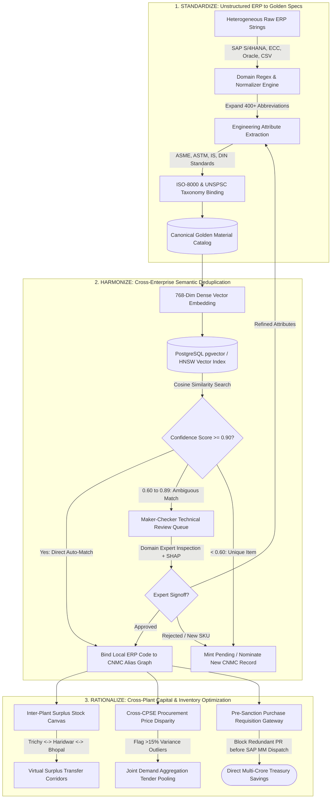

### 1. Standardize Process
*   **Problem**: In legacy ERP systems (SAP MM, Oracle, Maximo), identical physical parts are stored with cryptic, truncated, non-standard naming conventions (e.g. `VLV-BL-2-150-FLG`, `VALVE, BALL, FLANGED END, 50MM CL150`, `BRG 6205ZZ SKF`).
*   **MIRA Standardization Pipeline**:
    1.  **Domain Regex & Noise Cleansing**: 400+ industrial abbreviation rules expand shorthand (`BRG` $\to$ `BEARING`, `CS` $\to$ `Carbon Steel`, `50NB` $\to$ `2 Inch (50mm NB)`, `CL.150` $\to$ `ASME Class 150`, `WCB` $\to$ `ASTM A216 Gr. WCB`).
    2.  **Engineering Attribute Normalization**: Machine-learned entity extractors isolate **Noun** (`Valve`), **Modifier** (`Ball`), **Material** (`Cast Carbon Steel WCB`), **Pressure Rating** (`Class 150`), **Connection** (`Flanged RF`), and **Size** (`2" / 50mm`).
    3.  **ISO-8000 & UNSPSC Taxonomy Alignment**: Binds cleansed attributes into a validated, authoritative Golden Master specification compliant with **ISO-8000-110** data quality standards and 8-digit **UNSPSC** segment classification.

### 2. Harmonize Process
*   **Problem**: Every CPSE assigns its own local proprietary part numbers (`BHEL-MAT-630122`, `ONGC-40012984`, `SAIL-VAL-1092`). ERP vendors force expensive database redesigns to unify catalogs.
*   **MIRA Harmonization Pipeline**:
    1.  **Cross-Enterprise Dense Vector Embedding**: Transformers generate 768-dimensional dense vectors evaluated through HNSW cosine similarity.
    2.  **Zero-Disruption ERP Bridging**: CPSEs keep **100% of their existing internal ERP material numbers**. MIRA's middleware maps local codes to the unified **Common National Material Code (CNMC)** via a resilient `1:1` or `N:1` alias relational graph.
    3.  **Human-in-the-Loop Maker-Checker Governance**: Potential candidate matches with confidence between 60% and 89% are routed to the **Expert Review Queue**, where domain experts inspect SHAP feature attribution and ratify mappings with an Ed25519 digital signature.

### 3. Rationalize Process
*   **Problem**: While Plant A buys valves at ₹10,299 from external suppliers with a 6-month delivery lead time, adjacent Plant B has ₹33 Lakhs of surplus idle valves in storage. Furthermore, identical items across CPSEs exhibit 30% to 45% price variations.
*   **MIRA Rationalization Pipeline**:
    1.  **Inter-Plant Surplus Redistribution Canvas**: Real-time visibility into non-moving surplus stock across regional clusters (e.g., BHEL Trichy $\leftrightarrow$ BHEL Ranipet), allowing store officers to issue virtual inter-plant transfer requisitions before creating external purchase orders.
    2.  **Price Disparity Benchmarking**: Computes national weighted average rates and flags price outliers exceeding the 15% CVC tolerance threshold.
    3.  **Pre-Sanction PR Interception Gateway**: Automatically audits purchase requisitions (PRs) before dispatch to SAP MM. If an identical item exists in sister plant inventory, the PR is held for surplus fulfillment, directly eliminating wasteful procurement.

---

## 🖼️ Visual Software Walkthrough & UI Showcase

Every view depicted below represents verified runtime execution of the MIRA software platform captured from the production environment in [`Software_images`](file:///c:/Users/PIYUSH/Desktop/BMUI/Software_images).

---

### Part I: CPSE Enterprise Admin UI Suite

#### 1. CPSE Executive Dashboard
*   **Reference Screenshot**: `Software_images/WhatsApp Image 2026-09-29 at 9.27.36 AM.jpeg`
*   **Path in Code**: [`src/pages/CpseAdminPortalPage.tsx`](file:///c:/Users/PIYUSH/Desktop/BMUI/apps/web-desktop/src/pages/CpseAdminPortalPage.tsx)

<p align="center">
  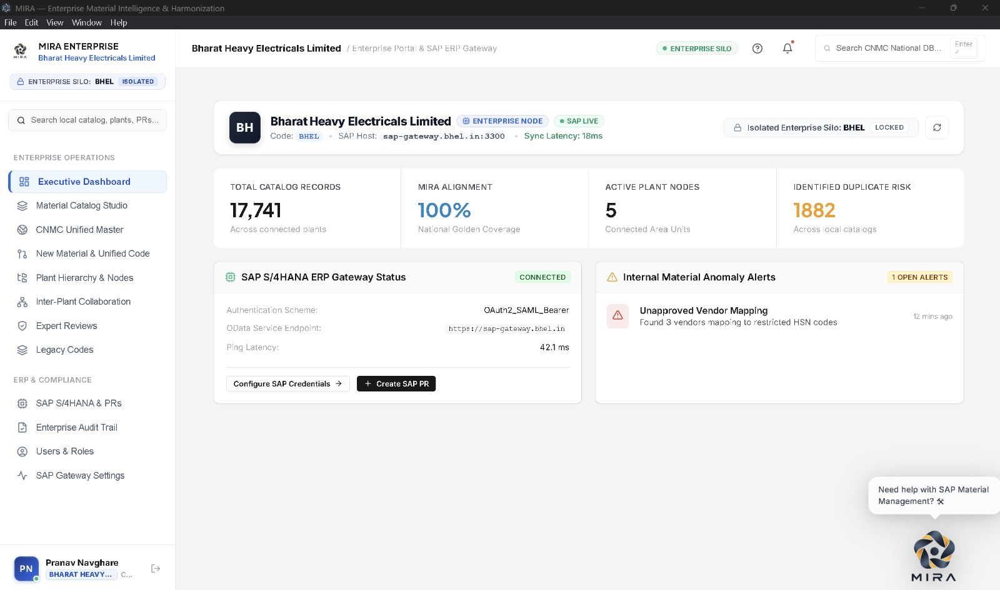
</p>

*   **Key Capabilities**:
    *   **Catalog Telemetry Metrics**: Monitors **17,741 Total Catalog Records** across connected plants with **100% National Golden Coverage**.
    *   **Duplicate Risk Detection**: Instantly flags **1,882 duplicate risks** across local enterprise catalogs for automated resolution.
    *   **Live SAP S/4HANA ERP Gateway Status**: Real-time bidirectional connection telemetry (`OAuth2_SAML_Bearer`, ping latency **42.1 ms**, endpoint `https://sap-gateway.bhel.in`).
    *   **Internal Material Anomaly Alerts**: Proactive alert cards highlighting compliance violations (e.g. *Unapproved Vendor Mapping: Found 3 vendors mapping to restricted HSN codes*).
    *   **MIRA Industrial AI Copilot**: Context-aware floating assistant helping officers initiate PRs and query inventory in real time.

---

#### 2. Material Catalog Studio & Intra-Enterprise Duplicate Detector
*   **Reference Screenshot**: `Software_images/WhatsApp Image 2026-09-29 at 9.27.34 AM.jpeg`
*   **Path in Code**: [`src/pages/CpseAdminPage.tsx`](file:///c:/Users/PIYUSH/Desktop/BMUI/apps/web-desktop/src/pages/CpseAdminPage.tsx)

<p align="center">
  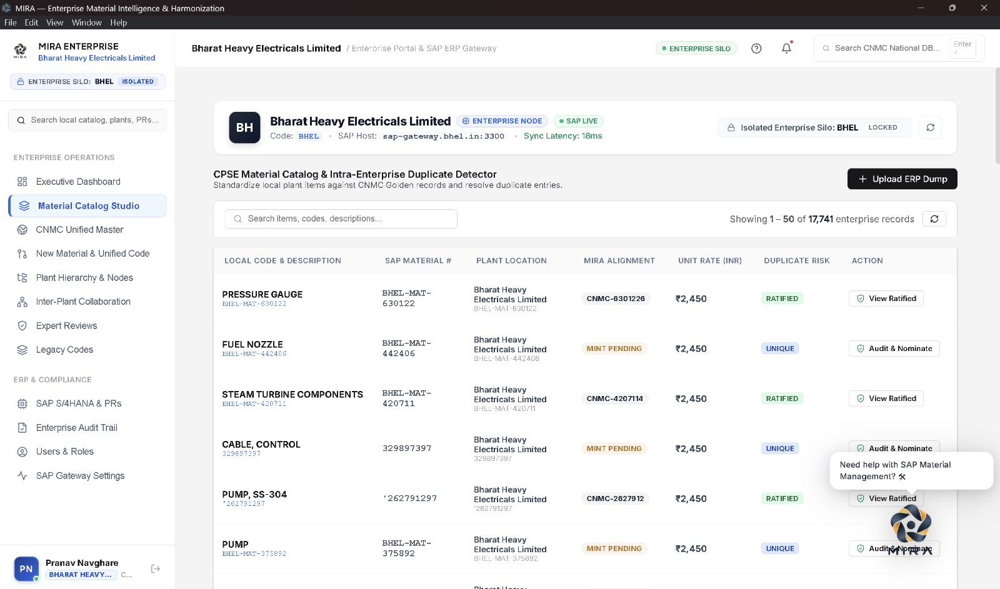
</p>

*   **Key Capabilities**:
    *   **Enterprise Silo Isolation**: Enforces tenant boundary isolation (`BHEL LOCKED`) with 18ms SAP sync latency.
    *   **Bulk ERP Dump Ingestion**: One-click **"+ Upload ERP Dump"** supporting multi-megabyte CSV and Excel catalog exports.
    *   **Local-to-CNMC Alignment Matrix**:
        *   Displays `Local Code & Description` (e.g., `PRESSURE GAUGE BHEL-MAT-630122`, `PUMP, SS-304`).
        *   Maps to SAP Material numbers and assigns alignment status: **RATIFIED** (`CNMC-630122`) or **MINT PENDING** (Unique candidates nominated for national cataloging).
        *   Action buttons for **View Ratified** specs or **Audit & Nominate** new codes.

---

#### 3. Multi-Tier Plant Hierarchy & Nodal Officer Delegation
*   **Reference Screenshot**: `Software_images/WhatsApp Image 2026-09-29 at 9.27.34 AM (1).jpeg`
*   **Path in Code**: [`src/pages/PlantAreaDashboardPage.tsx`](file:///c:/Users/PIYUSH/Desktop/BMUI/apps/web-desktop/src/pages/PlantAreaDashboardPage.tsx)

<p align="center">
  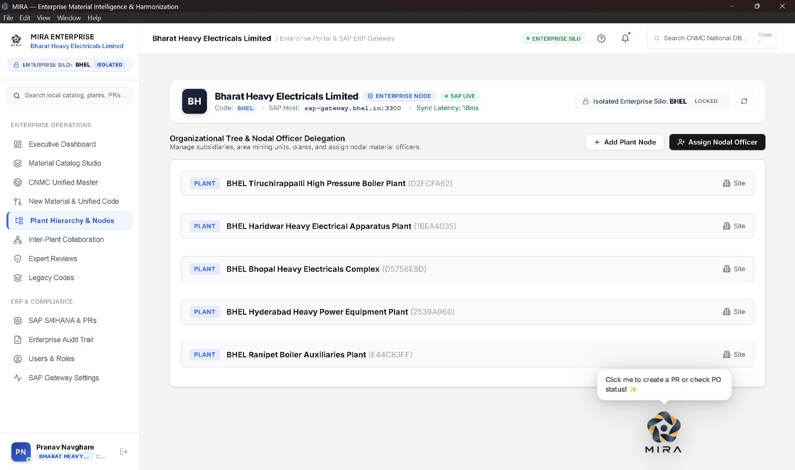
</p>

*   **Key Capabilities**:
    *   **Subsidiary & Plant Management**: Structured organization tree representing major manufacturing plants:
        *   *BHEL Tiruchirappalli High Pressure Boiler Plant* (`D2FCFA62`)
        *   *BHEL Haridwar Heavy Electrical Apparatus Plant* (`1BEA4035`)
        *   *BHEL Bhopal Heavy Electricals Complex* (`D5756E8D`)
        *   *BHEL Hyderabad Heavy Power Equipment Plant* (`2539A960`)
        *   *BHEL Ranipet Boiler Auxiliaries Plant* (`E44C83FF`)
    *   **Nodal Officer Allocation**: Allows Enterprise Admins to assign localized material custody and approval thresholds per plant node.

---

#### 4. Inter-Plant & Inter-CPSE Collaboration Canvas
*   **Reference Screenshot**: `Software_images/WhatsApp Image 2026-09-29 at 9.27.35 AM.jpeg`
*   **Path in Code**: [`src/pages/PlantAreaDashboardPage.tsx`](file:///c:/Users/PIYUSH/Desktop/BMUI/apps/web-desktop/src/pages/PlantAreaDashboardPage.tsx) & [`src/components/admin/InterPlantCollaborationGraph.tsx`](file:///c:/Users/PIYUSH/Desktop/BMUI/apps/web-desktop/src/components/admin/InterPlantCollaborationGraph.tsx)

<p align="center">
  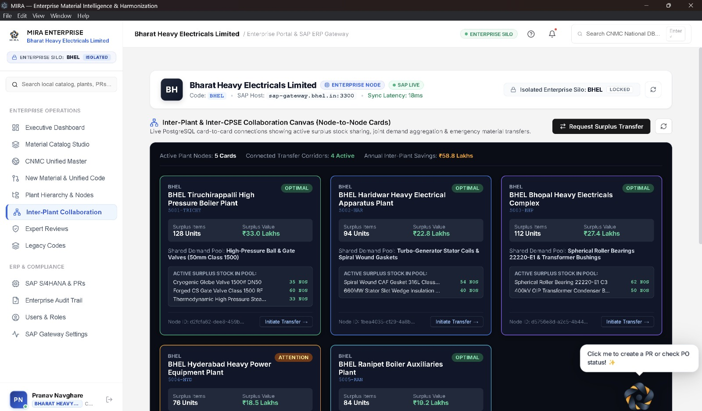
</p>

*   **Key Capabilities**:
    *   **Surplus Stock Sharing Matrix**: Live PostgreSQL card-to-card corridors visualizing surplus inventory available for transfer:
        *   **Trichy Plant**: 128 Surplus Units (Valued at **₹33.0 Lakhs**) - *Cryogenic Globe Valve 1500# DN50, Forged CS Gate Valve*.
        *   **Haridwar Plant**: 94 Surplus Units (Valued at **₹22.8 Lakhs**) - *Spiral Wound CAF Gasket 316L, 660MW Stator Slot Wedge Insulation*.
        *   **Bhopal Complex**: 112 Surplus Units (Valued at **₹27.4 Lakhs**) - *Spherical Roller Bearings 22220-E1 C3, 400kV OIP Transformer Bushings*.
    *   **Annual Savings Realized**: Calculates cumulative verified savings (**₹58.8 Lakhs**) achieved by fulfilling requirements from sister plants instead of external procurement.
    *   **1-Click Requisition**: Store officers can click **"Initiate Transfer"** to trigger inter-unit logistics workflows.

---

#### 5. SAP S/4HANA Purchase Requisition (PR) Gateway
*   **Reference Screenshot**: `Software_images/WhatsApp Image 2026-09-29 at 9.27.35 AM (1).jpeg`
*   **Path in Code**: [`src/pages/PlantAreaDashboardPage.tsx`](file:///c:/Users/PIYUSH/Desktop/BMUI/apps/web-desktop/src/pages/PlantAreaDashboardPage.tsx)

<p align="center">
  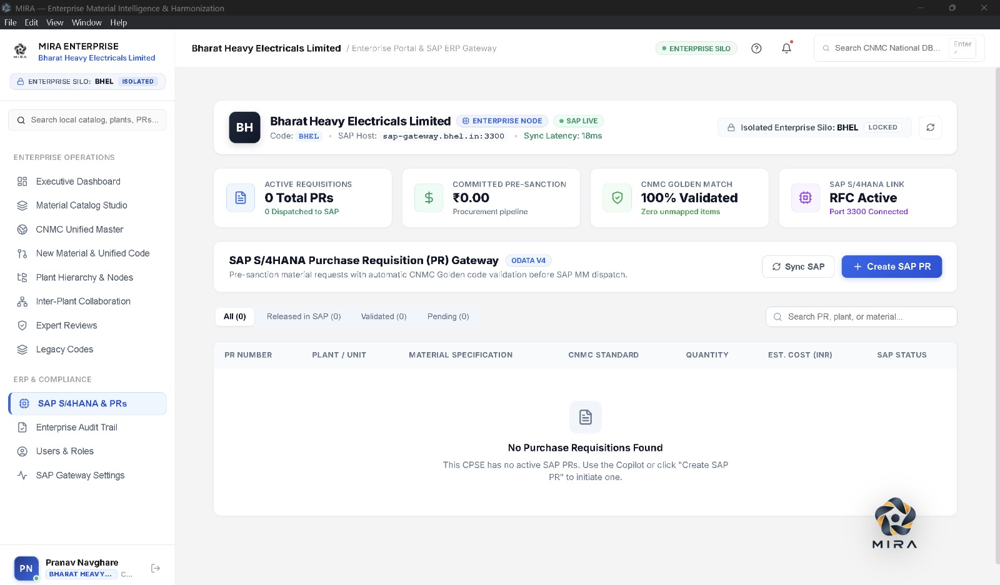
</p>

*   **Key Capabilities**:
    *   **OData v4 & RFC Connectivity**: Direct interface to SAP MM via active RFC connection on Port 3300.
    *   **Pre-Sanction Material Code Validation**: Intercepts PRs before dispatch to SAP MM to verify that requisitioned materials strictly adhere to CNMC Golden standards.
    *   **Pipeline Auditing**: Real-time status tabs for *Released in SAP*, *Validated*, and *Pending Validation*.

---

#### 6. Zero-Trust Access Governance & Dynamic RBAC
*   **Reference Screenshot**: `Software_images/WhatsApp Image 2026-09-29 at 9.27.39 AM.jpeg`
*   **Path in Code**: [`src/pages/UsersRolesPage.tsx`](file:///c:/Users/PIYUSH/Desktop/BMUI/apps/web-desktop/src/pages/UsersRolesPage.tsx)

<p align="center">
  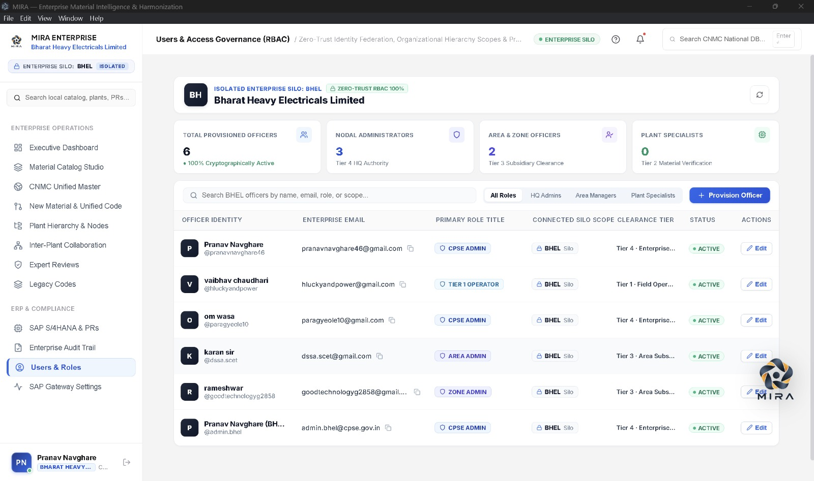
</p>

*   **Key Capabilities**:
    *   **Multi-Tier Perimeter Separation**:
        *   **Tier 4**: Nodal Administrators (Enterprise HQ Authority - `CPSE_ADMIN`)
        *   **Tier 3**: Area & Zone Officers (Subsidiary Clearance - `AREA_ADMIN`, `ZONE_ADMIN`)
        *   **Tier 2**: Plant Specialists (Material Verification)
        *   **Tier 1**: Field Operators (Terminal Operations)
    *   **Provisioned Officers Directory**: Live listing with email federation, connected silo scope (`BHEL Silo`), clearance tier, and one-click officer onboarding.

---

#### 7. Officer Profile & Sovereign Identity Enclave
*   **Reference Screenshot**: `Software_images/WhatsApp Image 2026-09-29 at 9.27.35 AM (2).jpeg`
*   **Path in Code**: [`src/pages/ProfilePage.tsx`](file:///c:/Users/PIYUSH/Desktop/BMUI/apps/web-desktop/src/pages/ProfilePage.tsx)

<p align="center">
  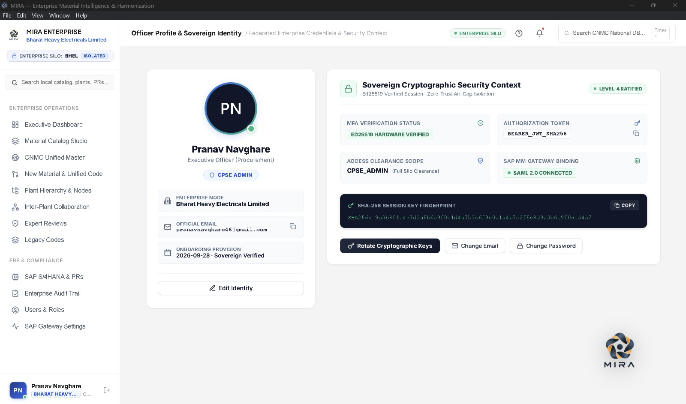
</p>

*   **Key Capabilities**:
    *   **Level-4 Sovereign Security Ratification**: Zero-trust air-gapped isolation with hardware-verified MFA (`ED25519 HARDWARE VERIFIED`).
    *   **SHA-256 Session Key Fingerprint**: Displays cryptographic session hash (`9a3b8f1c4e7d...`) with key rotation capabilities.
    *   **Federated Identity Clearance**: Scopes JWT authorization tokens directly to CPSE Silo and SAML 2.0 SAP MM gateway credentials.

---

#### 8. Enterprise Audit Trail & Sovereign Compliance
*   **Reference Screenshot**: `Software_images/WhatsApp Image 2026-09-29 at 9.27.38 AM (1).jpeg`
*   **Path in Code**: [`src/pages/AuditCompliancePage.tsx`](file:///c:/Users/PIYUSH/Desktop/BMUI/apps/web-desktop/src/pages/AuditCompliancePage.tsx)

<p align="center">
  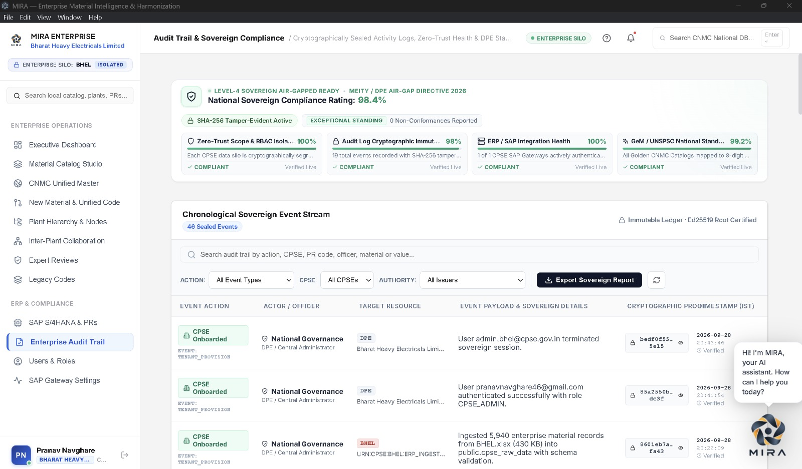
</p>

*   **Key Capabilities**:
    *   **MeitY / DPE Air-Gap Directive Compliance**: Achieves **98.4% National Sovereign Compliance Rating** with zero reported non-conformances.
    *   **Chronological Sovereign Event Stream**: 46 sealed events registered on an immutable ledger with Ed25519 root certification.
    *   **Cryptographic Proof Hashes**: Every tenant provisioning, ERP data ingestion (e.g. `BHEL.xlsx` 430 KB), and code ratification generates verifiable SHA-256 tamper-evident proof strings (`bedf0f55...`, `85a2550b...`).
    *   **Export Sovereign Report**: Generates CVC/CAG compliant compliance audits on demand.

---

### Part II: Sovereign National Governance UI Suite

#### 9. MIRA Sovereign Unified Material Master
*   **Reference Screenshots**: `Software_images/WhatsApp Image 2026-09-29 at 9.27.40 AM.jpeg` & `WhatsApp Image 2026-09-29 at 9.27.40 AM (1).jpeg`
*   **Path in Code**: [`src/pages/NationalGovernancePage.tsx`](file:///c:/Users/PIYUSH/Desktop/BMUI/apps/web-desktop/src/pages/NationalGovernancePage.tsx) & [`src/pages/CnmcMaterialPage.tsx`](file:///c:/Users/PIYUSH/Desktop/BMUI/apps/web-desktop/src/pages/CnmcMaterialPage.tsx)

<p align="center">
  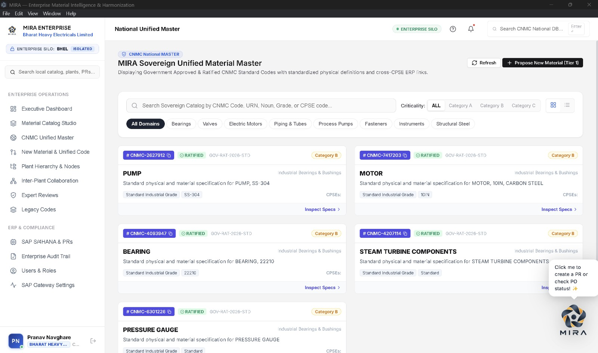
</p>

<p align="center">
  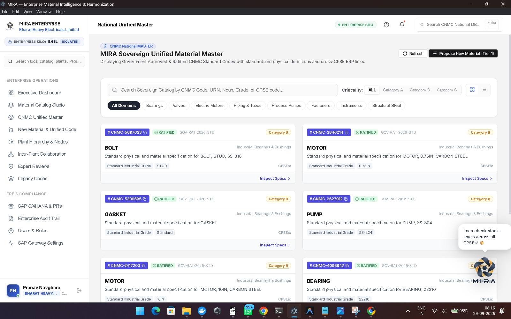
</p>

*   **Key Capabilities**:
    *   **Authoritative National Registry**: Displays government approved & ratified CNMC standard codes linking cross-CPSE ERP records.
    *   **Multi-Domain Domain Taxonomy**: Fast filtering across critical engineering domains:
        *   `Bearings` (`CNMC-4093947` - Bearing 22210)
        *   `Valves` (`CNMC-MEC-VLV-002150` - Ball Valve 2" 150#)
        *   `Electric Motors` (`CNMC-3846214`, `CNMC-7417203` - Motor 10IN Carbon Steel)
        *   `Piping & Tubes`, `Process Pumps` (`CNMC-2627912` - SS-304), `Fasteners` (`CNMC-5097023` - Stud Bolt SS-316), `Instruments` (`CNMC-6301226` - Pressure Gauge).
    *   **Criticality Stratification**: Classifies inventory into **Category A, Category B, Category C** for safety-critical maintenance prioritization.
    *   **Propose New Material (Tier 1)**: Workflow enabling plants to submit unmapped specifications for national standard adoption.

---

#### 10. Maker-Checker Expert Review Queue
*   **Reference Screenshot**: `Software_images/WhatsApp Image 2026-09-29 at 9.27.36 AM (1).jpeg`
*   **Path in Code**: [`src/pages/ExpertReviewerPage.tsx`](file:///c:/Users/PIYUSH/Desktop/BMUI/apps/web-desktop/src/pages/ExpertReviewerPage.tsx)

<p align="center">
  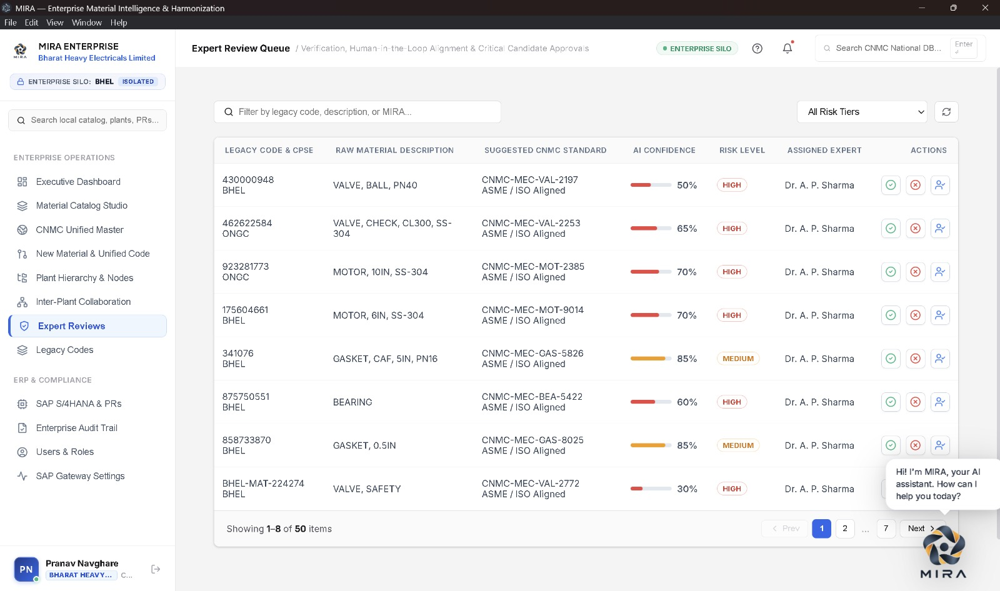
</p>

*   **Key Capabilities**:
    *   **Human-in-the-Loop AI Validation**: Queues ambiguous duplicate pairs or low-confidence matches for technical review.
    *   **Calibrated AI Confidence Scores**: Highlights algorithm match percentage (30% to 85%) with visual confidence progress meters.
    *   **Risk Tiers & Expert Dispatch**: Automatically flags items as **HIGH** or **MEDIUM** risk and assigns them to verified domain specialists (e.g. `Dr. A. P. Sharma`).
    *   **Maker-Checker Controls**: Provides one-click action buttons to **Approve (Green Check)**, **Reject (Red Cross)**, or **Reassign** to a peer specialist.

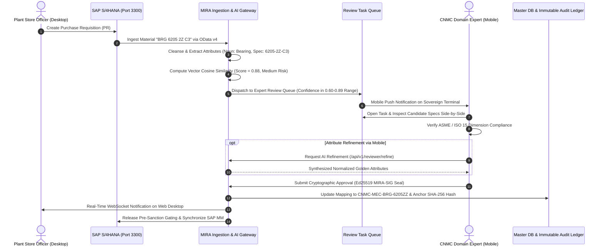

---

#### 11. Legacy Material Codes & Cross-CPSE Harmonization Mapping
*   **Reference Screenshots**: `Software_images/WhatsApp Image 2026-09-29 at 9.27.36 AM (2).jpeg` & `WhatsApp Image 2026-09-29 at 9.27.38 AM.jpeg`
*   **Path in Code**: [`src/pages/LegacyCodesPage.tsx`](file:///c:/Users/PIYUSH/Desktop/BMUI/apps/web-desktop/src/pages/LegacyCodesPage.tsx)

<p align="center">
  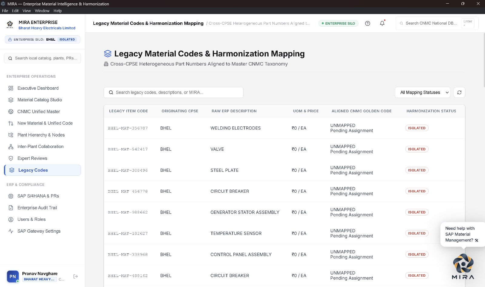
</p>

*   **Key Capabilities**:
    *   **Heterogeneous Part Number Normalization**: Ingests disparate legacy codes (`BHEL-MAT-356787`, `BHEL-MAT-542417`, `BHEL-MAT-308496`) with raw ERP descriptions.
    *   **Harmonization Tracking**: Isolates unmapped records (`ISOLATED`) and tracks pending national code assignments (`UNMAPPED Pending Assignment`).
    *   **Batch AI Resolution**: Powers instant harmonization against national golden taxonomy upon approval.

---

### Part III: Mobile Companion for CNMC Expert & Field Reviewers

#### 12. MIRA Sovereign Mobile Review Terminal (Expo React Native)
*   **Reference Screenshot**: `Software_images/WhatsApp Image 2026-09-28 at 7.28.24 PM.jpeg`
*   **Path in Code**: [`apps/mobile/`](file:///c:/Users/PIYUSH/Desktop/BMUI/apps/mobile) (`src/screens/ReviewerQueueScreen.tsx`, `AIRefinementModal.tsx`, `GovernanceDashboardScreen.tsx`)

<p align="center">
  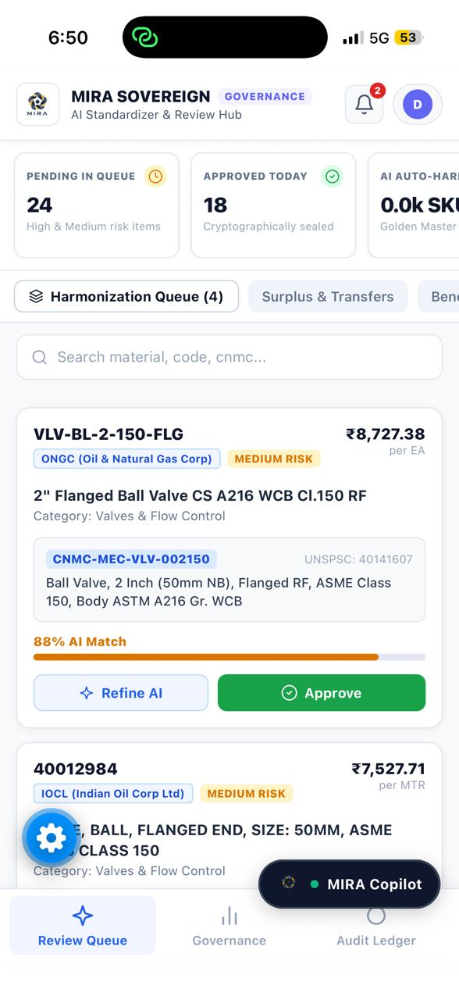
</p>

*   **Specialized Purpose**:
    While the Desktop application (`apps/web-desktop`) serves as the administrative powerhouse for plant engineering offices, the **MIRA Sovereign Mobile Terminal** (`apps/mobile`) provides **CNMC Domain Experts, Nodal Material Officers, and Field Storekeepers** with an untethered, high-velocity decision cockpit on mobile devices.
*   **Key Capabilities on Mobile**:
    *   **Live Review Triage**: Fast mobile triage of pending harmonization candidates (**24 Pending in Queue**, **18 Approved Today** cryptographically sealed).
    *   **Cross-CPSE Candidate Evaluation**:
        *   Inspects ONGC record `VLV-BL-2-150-FLG` (*2" Flanged Ball Valve CS A216 WCB Cl.150 RF*, ₹8,727.38/EA) side-by-side with IOCL record `40012984` (*50MM Flanged Ball Valve*, ₹7,527.71/MTR).
        *   Evaluates proposed **CNMC-MEC-VLV-002150** (UNSPSC `40141607`) with **88% AI Match** confidence.
    *   **Interactive AI Refinement (`AIRefinementModal.tsx`)**:
        *   Allows the expert to tap **"Refine AI"** to open a bottom-sheet synthesis window powered by `/api/v1/reviewer/refine`.
        *   Enables manual specification overrides (changing pressure class, body metallurgy, or end connections) before final sealing.
    *   **One-Tap Cryptographic Approval**:
        *   Tapping **"Approve"** immediately issues a digital signature (`MIRA-SIG-...` with SHA-256 seal) and updates both the desktop catalog and the backend database in real time.
    *   **Mobile Navigation**:
        *   `Review Queue`: Fast card swiping & candidate approvals.
        *   `Governance`: Real-time cross-CPSE harmonization metrics and inter-plant movement corridors.
        *   `Audit Ledger`: Mobile access to the cryptographic event stream.
        *   `MIRA Copilot`: Persistent floating assistant accessible across all screens.

---

## 🏛️ Desktop Application Architecture & Engineering

The desktop application is engineered using an Electron + Vite architecture designed for offline resilience, zero-lag rendering, and strict sandboxed security:

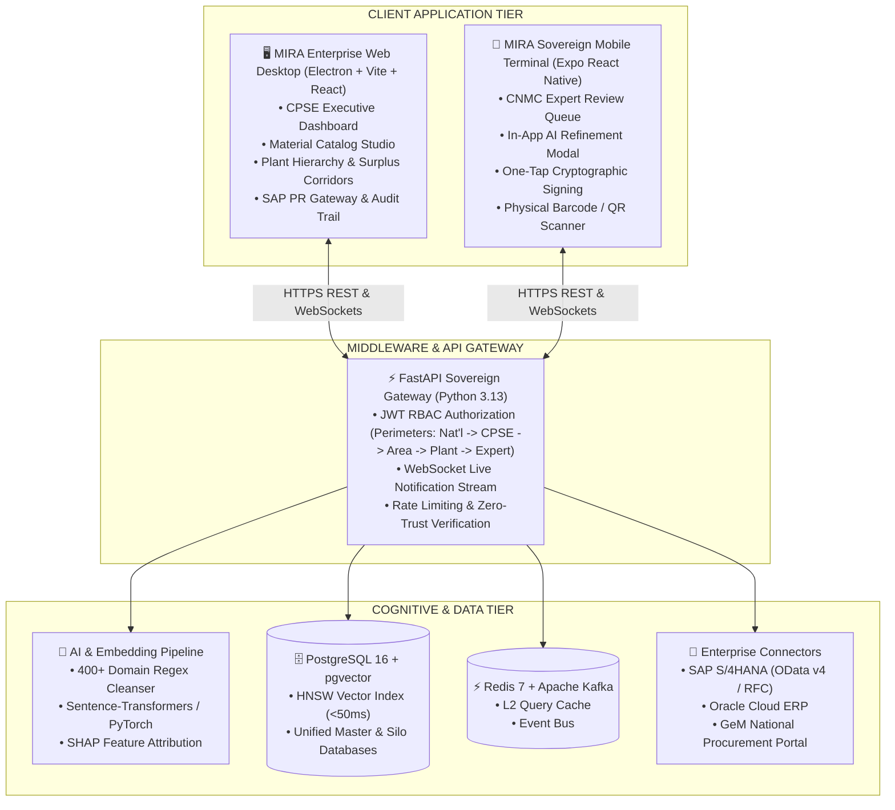

---

## 👥 Role-Based Access Control (RBAC) & Authority Matrix

The desktop application adapts its UI workspace according to the authenticated user's organizational perimeter:

| Role Title | Security Level | Clearance Perimeter | Desktop Capabilities & Visible Pages |
| :--- | :---: | :--- | :--- |
| **National Admin** | Level 1 | Sovereign Public Infrastructure (DPE/CVC/GeM) | Full visibility across all CPSEs, National Golden Catalog management, Sovereign Audit Log export, Price variance alerts. |
| **CPSE Admin** | Level 2 | Enterprise Silo (e.g. BHEL Corporate HQ) | Enterprise Executive Dashboard, Material Catalog Studio, Plant hierarchy management, User provisioning, ERP dump uploads. |
| **Area Manager** | Level 3 | Regional Subsidiary Cluster | Inter-Plant surplus collaboration canvas, surplus transfer requisitions, regional inventory aggregation. |
| **Plant Store Officer** | Level 4 | Operational Plant / Mine Unit | Local plant catalog search, SAP S/4HANA PR creation & gating, physical receipt reconciliation, emergency spare requests. |
| **CNMC Domain Expert** | Level 5 | Technical Engineering Specialization | Expert Review Queue (Maker-Checker candidate validation), SHAP feature attribution inspection, attribute override. |

---

## 🚀 Quick Start & Developer Setup

### Prerequisites
- **Node.js**: v18.0.0 or higher
- **npm**: v9.0.0 or higher
- **Backend Service**: Ensure the MIRA FastAPI backend is running on `http://localhost:8000`

### 1. Installation
```powershell
# Navigate to the desktop application directory
cd c:\Users\PIYUSH\Desktop\BMUI\apps\web-desktop

# Install frontend and desktop dependencies
npm install
```

### 2. Environment Configuration
Verify that `.env` is configured correctly:
```ini
VITE_API_BASE_URL=http://localhost:8000
VITE_ENABLE_MOCK_FALLBACK=true
VITE_DEFAULT_CPSE=BHEL
```

### 3. Launching in Browser Mode (Fast Web Development)
For rapid frontend component iteration without Electron packaging:
```powershell
npm run dev
```
*Access via browser*: `http://localhost:5173`

### 4. Launching in Native Electron Desktop Mode
Launches the full Electron desktop shell with native window frames and hardware acceleration:
```powershell
npm run electron:dev
```

---

## 📦 Building & Packaging Native Desktop Installers

To package the application into a standalone, portable Windows executable (`.exe`):

```powershell
# Build the production bundle and package Windows portable executable
npm run electron:build
```

The output installer is generated in:
```
apps/web-desktop/dist-electron/MIRA Enterprise Desktop-2.0.0-portable.exe
```

---

## 📱 Cross-Platform Linkage: Desktop & CNMC Expert Mobile App

The Desktop Workbench and the CNMC Expert Mobile App operate as an interconnected sovereign unit:

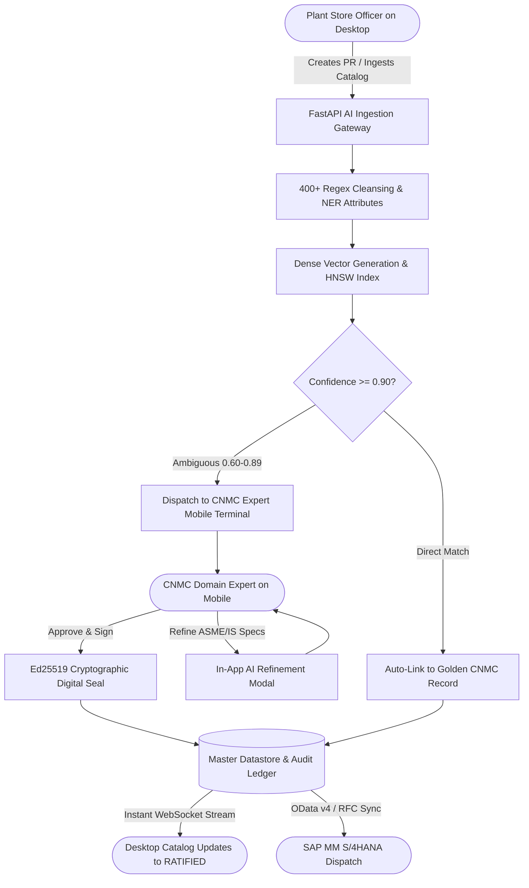

### Running the Mobile Companion App:
```powershell
cd c:\Users\PIYUSH\Desktop\BMUI\apps\mobile
npm install

# Start Expo Interactive CLI
npx expo start

# Press 'w' for instant browser preview
# Press 'a' to launch Android Emulator
# Or scan the QR code using Expo Go on a mobile device
```

---

## 🔐 Pre-Configured Demo Credentials

Use any of the following pre-configured credentials to explore the different desktop and mobile personas:

| Persona | Username | Password | Role | Connected Silo / Scope |
| :--- | :--- | :--- | :--- | :--- |
| **Enterprise CPSE Admin** | `admin.bhel` | `Password@123` | `CPSE_ADMIN` | Bharat Heavy Electricals Limited (BHEL) |
| **CNMC Domain Expert** | `reviewer.expert` | `Password@123` | `TECHNICAL_REVIEWER` | Mechanical, Valves & Piping Domain |
| **National Governance Officer** | `sharma.ap` | `Password@123` | `NATIONAL_ADMIN` | Sovereign Regulatory Authority (DPE) |
| **Plant Store Officer** | `plant.trichy` | `Password@123` | `PLANT_OFFICER` | BHEL Tiruchirappalli Boiler Plant |

---

*MIRA Enterprise Desktop & Sovereign Governance Platform | Developed for the National Unified Material Master Framework (NUMMF) & SIH 2026*
